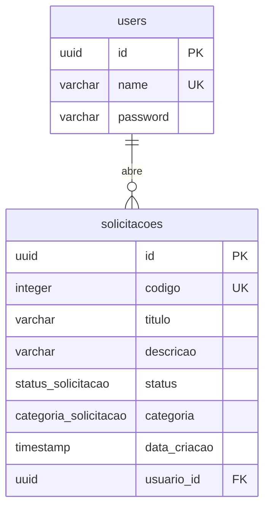

# Dicionário de Dados

## 1. Visão geral

- **SGBD:** PostgreSQL 16.
- **Schema:** criado e versionado por migrations do Drizzle ORM em `backend/drizzle/`, aplicadas automaticamente com `RUN_MIGRATIONS=true` ou manualmente com `npm run db:migrate`.
- **Fontes dos schemas:** `backend/src/modules/auth/schema/schema.ts` (users) e `backend/src/modules/solicitacoes/schema/solicitacao.schema.ts` (solicitacoes e enums).

| Migration | Conteúdo |
|---|---|
| `0000_volatile_sunspot.sql` | Cria `users` |
| `0001_melodic_polaris.sql` | Adiciona `users_name_unique` |
| `0002_equal_squadron_sinister.sql` | Cria enums, tabela `solicitacoes` e a FK para `users` |
| `0003` | Adiciona `solicitacoes.codigo` (identity, único) |

## 2. Diagrama ER

## 3. Entidades

### 3.1 `users`

| Campo | Tipo | Nulo? | Padrão | Chave/Restrição | Descrição |
|---|---|---|---|---|---|
| `id` | uuid | Não | `gen_random_uuid()` | PK | Identificador do usuário. |
| `name` | varchar(255) | Não | - | UNIQUE (`users_name_unique`) | Nome de usuário usado no login (campo `user` na API). |
| `password` | varchar(255) | Não | - | - | Hash bcrypt (custo 12) da senha; nunca a senha em texto. |

**Dados iniciais:** no primeiro start do backend (com `RUN_MIGRATIONS=true`), o seed cria os usuários listados em `DEMO_USERS` (padrão `usuario1` e `usuario2`, senha de `DEMO_PASSWORD`), caso ainda não existam (ver `backend/src/modules/db/seed.ts`).

### 3.2 `solicitacoes`

| Campo | Tipo | Nulo? | Padrão | Chave/Restrição | Descrição |
|---|---|---|---|---|---|
| `id` | uuid | Não | `gen_random_uuid()` | PK | Identificador da solicitação. |
| `codigo` | integer | Não | `GENERATED ALWAYS AS IDENTITY` | UNIQUE (`solicitacoes_codigo_unique`) | Número sequencial legível da solicitação (ver seção 6). |
| `titulo` | varchar(255) | Não | - | - | Título resumido. |
| `descricao` | varchar(255) | Não | - | - | Descrição da solicitação (limitada a 255 caracteres). |
| `status` | `status_solicitacao` | Não | `'Aberto'` | - | Situação atual no fluxo de atendimento. |
| `categoria` | `categoria_solicitacao` | Não | - | - | Área responsável/tipo da solicitação. |
| `data_criacao` | timestamp (sem fuso) | Não | `now()` | - | Data/hora de criação. |
| `usuario_id` | uuid | Não | - | FK -> `users.id` (`solicitacoes_usuario_id_users_id_fk`) | Autor (solicitante). |

## 4. Enums

### `categoria_solicitacao`

| Valor | Significado |
|---|---|
| `TI` | Tecnologia da Informação |
| `RH` | Recursos Humanos |
| `Compras` | Aquisições e compras |
| `Financeiro` | Assuntos financeiros |
| `Infraestrutura` | Infraestrutura e instalações |

### `status_solicitacao`

| Valor | Significado |
|---|---|
| `Aberto` | Estado inicial; aguardando atendimento. Único estado em que o autor pode editar ou excluir. |
| `Em Atendimento` | Solicitação em tratamento. |
| `Concluído` | Atendimento finalizado. |

## 5. Relacionamentos e regras de negócio

**Relacionamento:** `users` 1 — N `solicitacoes` via `solicitacoes.usuario_id -> users.id`, `ON DELETE NO ACTION` e `ON UPDATE NO ACTION` (não há exclusão em cascata; um usuário com solicitações não pode ser removido).

**Regras que afetam os dados** (`solicitacoes.service.ts`, `auth.service.ts`):

- O status inicial é sempre `Aberto` (padrão do banco; a criação não aceita `status`).
- `usuario_id` vem do usuário autenticado (JWT), não do corpo da requisição.
- Editar (`titulo`, `descricao`, `categoria`) e excluir só são permitidos com status `Aberto` (senão 400) e somente pelo autor (senão 403).
- A alteração de status (`PATCH` de status) não verifica autoria nem transição: qualquer usuário autenticado pode definir qualquer valor do enum.
- Senhas são armazenadas como hash bcrypt com custo 12.

**Validações (Zod)**

| Campo | Regra |
|---|---|
| `titulo` | mínimo 3 caracteres; sem máximo no DTO, mas a coluna é varchar(255) |
| `descricao` | mínimo 3 caracteres; sem máximo no DTO, mas a coluna é varchar(255) |
| `categoria` | um dos valores de `categoria_solicitacao` |
| `status` | um dos valores de `status_solicitacao` |
| `user` (cadastro/login) | mínimo 3 caracteres; sem máximo no DTO, mas a coluna é varchar(255) |
| `password` (cadastro/login) | mínimo 8 caracteres; sem máximo (o hash ocupa 60 caracteres) |
| Listagem: `page` / `limit` | `page` >= 1 (padrão 1); `limit` entre 1 e 50 (padrão 10) |

Atenção: como o DTO não limita o tamanho máximo de `titulo` e `descricao`, valores acima de 255 caracteres passam pela validação e são rejeitados pelo banco (erro de truncamento/valor longo demais).

## 6. Campo `codigo`

`codigo` é um inteiro sequencial gerado pelo banco (`GENERATED ALWAYS AS IDENTITY`), portanto não pode ser informado na inserção. É único e não nulo. A API devolve apenas o número; a interface o exibe como `SOL-0001` (prefixo `SOL-` mais o número com 4 dígitos, preenchido com zeros à esquerda). O formato é montado na apresentação e não é armazenado. Introduzido pela migration `0003`.
